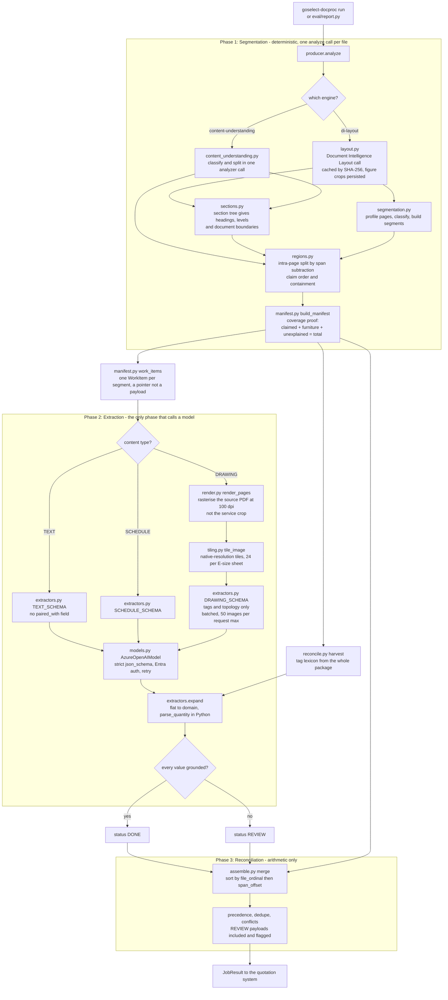
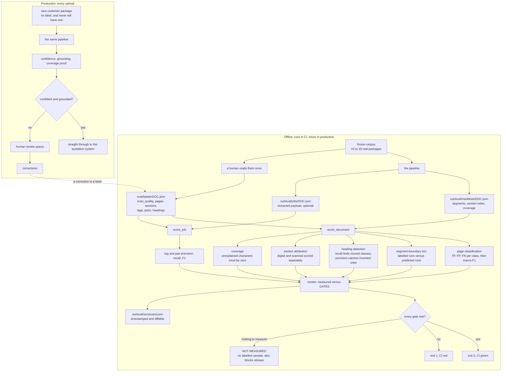

# Document processing for mixed engineering specification packages

Turns a heterogeneous specification package into validated, traceable,
quotation-ready structured data that a downstream quotation system can consume.

**The design in one line:** the pipeline's unit of work becomes the *content
region* instead of the *file*. Everything else in the surrounding cloud
architecture stays as drawn.

```bash
conda activate goselect
python eval/report.py --producer=content-understanding spec.pdf oneline.pdf
```

---

## 1. The problem

A drives supplier receives specification packages from customers and channel
partners and must turn them into a bid. A single opportunity arrives as several
PDFs mixing narrative specification, tabular schedules and engineering drawings —
often scanned, sometimes annotated by hand.

Three defects were reported.

| # | Symptom | Actual cause |
|---|---|---|
| 1 | A mixed PDF is classified once and routed down one branch | The loop variable is the **file**. A file has one label; its pages do not |
| 2 | Section references are misattributed, worse on scans | Attribution fell back to *nearest text above in reading order*, which is wrong on two-column and landscape pages |
| 3 | Parallel per-type outputs are hard to recombine | No total order over the parts, and no proof nothing was dropped |

A fourth was reported inside the first: drawing tags come back corrupted —
`VFD-401` extracted as `$\sqrt{150-401}$`. Two stacked causes, neither an OCR
quality problem: `ocr.formula` reads the box around a tag as a radical sign, and
the sheet is downscaled below glyph legibility before any vision model sees it.

### Why one package proves the point

The test corpus is real customer material. **Package A** is a two-file
opportunity: a nine-page scanned submittal — seven pages of Division 16
specification prose, two drawing sheets, pen annotations — plus a separate
one-line diagram.

**Neither file alone can produce a quote:**

- The specification says *what kind* of drive — a named manufacturer and model,
  460 V, 3-phase, passive filter — and names no individual equipment.
- The one-line says *which* drives exist — four tagged drives, none of them
  mentioned in the specification.
- The ratings exist only as handwriting on the drawing sheets: *3× 124 Amp,
  1× 65 Amp*.

The specification says so explicitly: *"Refer to the single line diagrams on the
electrical sheets for the minimum required VFD ampacity ratings."* The document
instructs you to reconcile across files.

**Package B** is a four-sheet E-size drawing set with no prose at all — the case
that exposed the resolution problem in §5.

---

## 2. What the pipeline does

Nine stages, ~4,300 lines across 23 modules.

| Stage | Input | Output | Module |
|---|---|---|---|
| Read | PDF bytes | One text string plus geometry for every element | `layout.py` |
| Classify | Per-page measurements | TEXT / SCHEDULE / DRAWING per page | `segmentation.py` |
| Group | Page labels | Segments — runs of same-type pages | `segmentation.py` |
| Split inside pages | Table and figure geometry | Regions, by span subtraction | `regions.py` |
| Index sections | The layout model's section tree | Heading → character offset, with document boundaries | `sections.py` |
| Prove coverage | All spans | Assert every character is accounted for | `manifest.py` |
| **Render drawings** | **Source PDF, chosen DPI** | **Page images the service never downsampled** | **`render.py`** |
| Extract | One segment | Structured fields, per-type schema and model | `extractors.py` |
| Merge | All segment results | One payload, ordered, deduped, conflicts surfaced | `assemble.py` |

**Split the index, not the bytes.** One analyze call per file produces one
immutable `content` string; every region is a `(offset, length)` range over it.
Regions are views, never copies, so reassembly is a sort.

### Execution order



Everything in Phase 1 is deterministic and costs one analyze call per file.
Phase 2 is the only place a model is called. Phase 3 is arithmetic.

---

## 3. Fix per problem

### Problem 1 — multi-type PDFs

Two levels. **Page-level split** via Content Understanding `contentCategories`
with `enableSegment` — categories defined by description, no training data.
**Intra-page split** by span subtraction over the layout result, with two rules
that make it exact rather than a proximity guess:

- **Claim order depends on content type.** On a drawing sheet the title block and
  revision table are *tables* belonging to the drawing, so figures claim first.
- **Containment.** A figure absorbs any table whose bounding box sits inside it.

No managed service does the second for you: *"The minimum unit for classification
of documents is a single page. Intra-page classification isn't supported."*

**Free fixes, no code:** set `ocr.formula = off` on drawings; set
`splitMode = auto` if a custom classifier is in use (v4.0 GA defaults to `none`,
returning one class for a multi-document PDF — exactly the reported symptom).

### Problem 2 — traceability

**The output contract has nowhere to put evidence.** The agreed extraction schema
defines 107 fields across 5 levels and contains **no provenance field**.
Traceability cannot survive a contract with no slot for it. A proposed `v1.1`
adds one block per value: `file_id`, `page`, `section_path`, `spans`, `polygon`,
`origin`, `verbatim`, `confidence`.

**Grounding from the service.** Content Understanding returns page number,
bounding box and a 0–1 confidence per field when
`estimateFieldSourceAndConfidence` is set — since July 2026 for `extract`,
`classify` and `generate` fields alike.

**Section breadcrumbs, which no service provides.** Grounding says *where on the
page*; a reviewer needs *which clause*. Document Intelligence's own `sections`
tree supplies the hierarchy, and — critically — its root children are separate
documents stapled into one file. On Package A the specification occupies offsets
0–18,684 and the drawing sheets 18,708–21,911. Attribution never crosses that
line.

Two rules are enforced on top, because the service's tree is imperfect:

- A **drawing segment never inherits a prose clause**. The service split one
  sheet out correctly but folded the other into the last clause of the
  specification.
- When the service reports **no hierarchy**, emit no headings. Falling back to
  paragraph-role scanning produced **255 "headings"** on a one-line diagram —
  every equipment label on the schematic.

**The invariant:** every value carries page, span and section evidence, or it is
rejected and routed to review.

### Problem 3 — reconstructing parallel work

- **A total order:** `(file_ordinal, span_offset)`. `file_ordinal` is frozen at
  job creation. Never sort by page number — once a page holds several regions it
  is not a total order.
- **Idempotency:** the document store id is `{jobId}:{fileId}:{segmentId}`, so
  at-least-once redelivery is an upsert.
- **Completion without polling:** count *distinct* terminal segment documents and
  trigger reconciliation from the change feed when
  `distinct(DONE) + distinct(FAILED) == expected_units`.
- **A coverage proof:** `claimed + furniture + unexplained == total`, and
  `unexplained == 0`. Alert on any drift — silent content loss is the failure
  nobody notices.

**Merge precedence — the customer must sign this off. It is domain policy, not
engineering.**

| Value kind | Precedence | Reason |
|---|---|---|
| Numeric specifications | SCHEDULE > TEXT > DRAWING | The grid is authoritative |
| Pairing / topology | DRAWING > SCHEDULE > TEXT | The diagram shows the wiring |

Disagreement becomes a `Conflict` carried in the result and routed to review. It
is never silently resolved. Segments marked `REVIEW` still contribute their
payload — a reviewer needs candidates to check, not a blank page.

---

## 4. Build versus buy — measured, not argued

Both engines, same package, same extraction models.

| | Layout + our classifier | Content Understanding |
|---|---|---|
| Segmentation correct | 3/3 | 3/3 |
| **Segmentation confidence** | **0.31 / 0.59 / 0.59** | **1.00 / 1.00 / 1.00** |
| Headings found | 20 | 19 |
| Coverage | 100% | 100% |
| End to end | **40 s** | 82 s |
| Correct drive–motor pairs | 4/4 | 4/4 |
| Pair precision | 0.44 | 0.36 |

**Delete our page classifier.** Content Understanding reached the right answer at
confidence 1.00 with no training data and no tuning. Ours reached the same answer
at 0.31 after a bug fix. That is ~200 lines of `segmentation.py` plus its tuning
risk, gone.

**Keep the rest.** The layout model is twice as fast, and extraction quality is
identical because the engine only decides how pages are split, not what is
extracted.

### What no vendor sells

| Gap | Why |
|---|---|
| Intra-page separation | Every managed classifier's minimum unit is a page — a documented architectural limit |
| Section breadcrumbs | Grounding answers *where on the page*, not *which clause* |
| Native-resolution CAD reading | Every vision path downscales to a token budget |
| Cross-region precedence | "A schedule outranks a drawing for a kW rating" is customer policy |

**Content Understanding cannot read engineering drawings.** `enableFigureAnalysis`
supports `Bar`, `Line`, `Pie`, `Radar`, `Scatter`, `Bubble`, `Quadrant`, `Mixed`,
`Flow chart`, `Sequence` and `Gantt` — all business charts. A one-line diagram is
none of them. It also returns figure *descriptions* and chart.js or mermaid, with
**no image bytes and no retrieval endpoint**, unlike Document Intelligence. So the
drawing image has to be produced locally whichever engine does the routing.

### Alternatives considered

- **Mistral OCR 4** returns bounding boxes, block classification and per-word
  confidence — genuinely strong. The Azure variant is 30 pages / 30 MB, English
  only, Preview. Disqualifying for 40-page packages. Re-evaluate at parity.
- **Docling, MinerU, Marker** are excellent structural parsers with no field
  extraction, no confidence and no grounding. They move work from a cloud bill to
  a self-managed GPU fleet without shrinking the four gaps.
- **LlamaParse, Reducto, LandingAI ADE** solve grounding well and fail residency
  outright. Worth one control arm to price what residency costs in accuracy.

---

## 5. Model selection — measured

Both conclusions are evidence-based and they point opposite ways.

**Text: use the mini.** On the Package A specification, scored against a
hand-typed answer key:

```
model              values  clauses    sec
gpt-5.4-mini        9/10     9/10     3.3
gpt-5.4             9/10     9/10     5.5
gpt-5.6-sol        10/10    10/10     7.0
```

The single differing field was not a quality gap. The document states both
*"Minimum speed (1 to 60 HZ)"* and *"Variable torque performance from 4 to 60
Hertz"* in different clauses. Each model cited a real, verifiable clause. **The
citation requirement is what made that visible** — and it is a `Conflict` for the
customer to adjudicate, not an extraction error.

**Drawings: the flagship is not optional.**

```
model           mode           tags  drives correct
gpt-5.4-mini    whole image      8     0/4   <- all fabricated
gpt-5.4-mini    tiled            0     0/4
gpt-5.6-sol     whole image     10     3/4   <- one character misread
gpt-5.6-sol     tiled           10     4/4
```

The mini invented an entire plausible tag scheme that appears nowhere on the
drawing. Tiling supplied the last character on the flagship: the whole-image pass
misread a single letter in one tag — the difference between quoting a 124 A drive
and a 65 A one.

### Drawings: the bottleneck is pixels, not the model

On Package B, Content Understanding returned `VD-401` paired with `RWP-A01`. The
truth is `VFD-401` feeding `RWP-401` — a dropped glyph and a `4→A` substitution,
both signatures of text below legibility.

Three causes, none of them the model:

| Cause | Detail |
|---|---|
| The model saw no image | `ContentUnderstandingProducer.figure_image()` returns `None`. The drawing branch was reading OCR text only |
| The lexicon was empty | Harvest was `SCHEDULE`-only; a drawings-only package has none. The layout model reads **122 correct tags** on that same sheet |
| The crop was already downsampled | The service's crop is **1477×934**. The sheet at 100 dpi is **3600×2400** |

Walking the resolution ladder on sheet 1, with the package-wide lexicon applied:

```
source                       tiles   vis-tokens   VFD-401 / RWP-401
service figure crop 1477x934   —          —       VD-401 / RWP-A01   WRONG
rendered  100 dpi 3600x2400    24        ~18k     VFD-401 / RWP-401  correct
rendered  150 dpi 5400x3600    48        ~37k     VFD-401 / RWP-401  correct
```

**100 dpi is the default**: same tags as 150, half the tokens, and it fits under
the 40-tile cost guard where 150 does not. The full four-sheet package then
returns **14 pairs, status DONE, nothing needing review**, with a self-consistent
numbering scheme — every drive tag matching its motor tag suffix — which is itself
a signal, because a misread breaks the pattern.

### Service limits that shape the design

**Images per request: 50.** A four-sheet drawing segment at 100 dpi produces 51
tiles and the whole segment fails with `HTTP 400`. Tiles are batched across
requests and merged; overlap duplicates were already handled by the pair dedupe.

**Tile cap raises, it does not truncate.** Exceeding `max_tiles` throws rather
than silently dropping tiles, so a cost overrun is visible instead of becoming
quiet content loss.

**Vision.** Azure OpenAI with `detail="high"` fits the image into 2048×2048, then
if the shortest side still exceeds 768 px scales again so that it is 768. On an
E-size sheet that is a scale of ~0.075 and 10 pt glyphs arrive ~3 px tall — worse
than Claude's standard tier, because the cap is on the *shortest* side.

**Schema.** Strict structured output allows **100 object properties and 5 levels
of nesting**. The agreed contract is **107 properties at depth 5** — over the
limit and at the ceiling. Extraction schemas are therefore split per content type
and expanded to the nested delivery shape in Python:

| Branch | Schema | Why |
|---|---|---|
| TEXT | **no `paired_with` field** | Spec prose pairs nothing. The model *cannot* invent a pairing |
| SCHEDULE | full item + `paired_with` | A row carries drive and motor together |
| DRAWING | tag + `paired_with` only | Ratings read off a diagram are unreliable |

---

## 6. Evidence and gates

`eval/score.py` asserts gates rather than printing numbers to admire. It exits
non-zero, so it belongs in CI. **It never runs in production** — labels are exam
papers, not pipeline inputs. A production job has no label and never will: it
runs, emits confidence, grounding and a coverage proof, and routes what it is
unsure about to review.



`score_document` never scores what it cannot see: a gate with no labelled sample
reports **NOT MEASURED** rather than `0.000`, because a gate that fails because
nothing was measured hides the gates that really failed.

| Gate | Required | Measured on Package A |
|---|---|---|
| Page classification macro-F1 | 0.85 | **1.000** |
| Segment boundary IoU | 0.90 | **1.000** |
| Section heading F1 | 0.90 | **0.947** |
| Section attribution — digital | 0.95 | not measured |
| Section attribution — **scanned** | 0.80 | **1.000** |
| Coverage pass rate | 1.00 | **1.000** |
| Drive–motor pair F1 | 0.90 | precision **0.44** |

Labels are five keys per document — `scan_quality`, `pages`, `sections`, `tags`,
`pairs`, plus optional `headings`. A 9-page document is **382 bytes**. **The
customer must write them**, because the answer key *is* the domain truth: only
they can say that a given tag is a solid-state starter and therefore out of scope
for a variable-frequency-drive specification.

**The review queue produces labels for free.** When a reviewer corrects an
extraction, that correction is a label. Most orchestration designs already store
user corrections in the job record — that field is the label pipeline.

### Known defects

1. **Precision 0.44 on pairs.** Both engines emit soft-starter tags as though
   they were drives. Quoting six drives instead of four is exactly the commercial
   error this exists to prevent.
2. **Pairs counted in both directions.** `A ↔ B` and `B ↔ A` are the same
   relationship.
3. **Junk pairs** from generic diagram labels — `VFD ↔ MOTOR`.
4. **Service figure crops arrive at ~1480×990**, well below the resolution a tag
   needs. Fixed by rasterising the source PDF locally, but it means drawing
   extraction depends on `pymupdf` rather than on the service alone.
5. **The SCHEDULE branch is untested.** No document in the corpus has a real
   equipment schedule.
6. **Cost on drawing-heavy packages.** The four-sheet Package B took 146 s and
   roughly 72k visual tokens. Bound this before scaling.

---

## 7. What is proven, and what is not

**Proven on real customer data:** span subtraction, 100% coverage,
order-independent reassembly, section breadcrumbs on a scanned document (18/18
headings), cross-file tag recovery, the vision budget, conflict surfacing, and
tag-level accuracy on a four-sheet E-size drawing package once rendered at 100 dpi
(14 pairs, no corrupt tags).

**Not proven:** pair precision, schedule extraction, anything on a package not yet
supplied. **Every number in this document comes from four documents. Hand-label
15–20 real packages before quoting any of it.**

---

## 8. Running it

```bash
conda env create -f environment.yml      # conda-forge only; PyPI may be blocked
conda activate goselect
pip install -e . --no-deps --no-build-isolation   # local, no network
cp .env.example .env                     # fill in the two endpoints
az login                                 # DefaultAzureCredential

pytest -q                                # 102 tests, no cloud calls, no spend
```

| Command | Cost | Purpose |
|---|---|---|
| `goselect-docproc segment <pdf>...` | one analyze call per file, cached | Boundaries and coverage proof |
| `goselect-docproc plan <pdf>...` | none | The exact queue messages |
| `goselect-docproc run <pdf>... --model <deployment>` | model spend | Full pipeline |
| `goselect-docproc tiles 13200 10200` | none | Vision budget before spending a token |
| `python eval/report.py --producer=<engine> <pdf>...` | model spend | The HTML report |
| `python eval/score.py` | none | The scorecard |

Results are cached by content SHA-256, so the same bytes are never analysed or
billed twice.

### Where results go

```
out/
  runs/<package>/<engine>/    report.html, summary.json, manifest.json,
                              results.json, job.json
  eval/                       scorecard.json, manifests/
```

`<package>` is the shared stem of the input files, `<engine>` is the producer.
Everything under `out/` is regenerable and safe to delete.

---

## 9. Integration

**One new state, one changed loop variable, one new state at the tail.** Object
storage, the message bus, container jobs, the document store, the model gateway,
API management, identity, secrets, correlation IDs and CI/CD all stay as drawn.

```
Initialise
  └─ Segmentation                          <-- NEW
       └─ Extraction_Orchestration
            ├─ for each TEXT region      -> LLM
            ├─ for each SCHEDULE region  -> LLM
            └─ for each DRAWING region   -> LLM (vision, native-res tiles)
       └─ JSON_Validation
       └─ CrossSegment_Reconciliation      <-- NEW
       └─ Save_Results
```

**Storage — write once, never mutate.** The document store holds job state and one
document per region result, partitioned on `/job_id`. Nothing large goes in the
document store; nothing mutable goes in object storage.

**Queue message is a pointer, never a payload** — job and correlation ids, file
and segment ids, page range, spans, section root, analysis URI, figure ids, and
the per-segment feature flags. The worker fetches the slice it needs.

**Per-segment feature flags.** Applying high-resolution OCR to a whole package is
money spent on prose pages:

| Region | `ocr.highResolution` | `ocr.formula` |
|---|---|---|
| TEXT | off | off |
| SCHEDULE | off | off |
| DRAWING | **on** | **off** |

**Alert on three things**, all silent failures otherwise: `unexplained_chars > 0`,
the share of regions routed to review, and tiles per drawing above the guard.

**Figure crops must be persisted during segmentation.** The service serves them
from `/analyzeResults/{resultId}/figures/{id}` only while it retains the result,
and a cache hit has no result id at all. Deferring the fetch is how drawing
segments silently lose their images.

---

## 10. Decisions the customer must make

1. **Merge precedence** — does a schedule or a drawing win a disagreement about a
   motor rating?
2. **Failure posture** — fail closed, return partial data flagged, or hold for
   review? The default here is *partial, flagged, held*.
3. **Residency** — Content Understanding and Document Intelligence are
   cloud-native to one platform. Higher-scoring alternatives are not.
4. **Language scope** — some OCR options are English-only in their managed form.
5. **Review capacity** — who staffs the queue, and what correction rate is
   acceptable at go-live?
6. **Corpus access** — 15–20 real packages including scans and a real equipment
   schedule. This is the critical-path dependency and no code substitutes for it.

---

## 11. Phasing

| Phase | Content | Exit criterion |
|---|---|---|
| 0 — Free fixes | `ocr.formula` off for drawings; `splitMode=auto`; read the coverage report | Coverage 100%, tag corruption reduced |
| 1 — Contract | Agree the schema with a `source` block; agree merge precedence | Customer signs both |
| 2 — Evidence | Hand-label 15–20 real packages; publish the scorecard | **Go / no-go gate** |
| 3 — Shadow | Run alongside the current pipeline, writing manifests but not consuming them | Output compared on the same documents |
| 4 — Cut over | Change the loop variable one content type at a time | Manual correction rate at or below baseline |
| 5 — Consolidate | Delete the losing engine and unused adapters | One code path |

Phases 0 and 1 have no dependency on Phase 2 and should start immediately.
