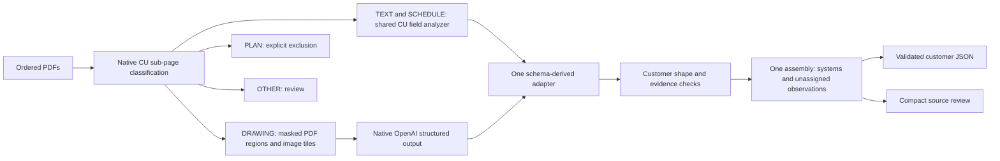
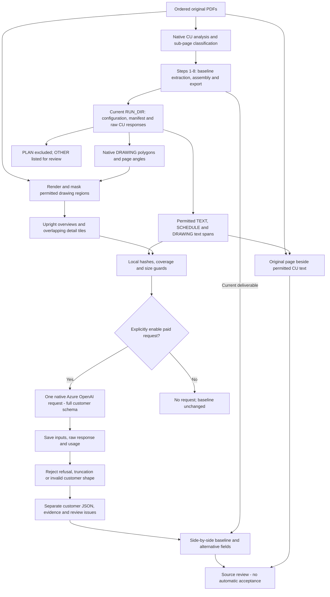

# GoSelect Document Processing

Extract VFD and motor specifications from a PDF package using native Azure Content Understanding (CU) and the native Azure OpenAI SDK. The baseline uses segment extraction and one assembly pass. An opt-in notebook alternative sends the saved permitted CU content and original drawing regions together in one document-set request, without baseline assembly.

**Current status:** offline checks cover both paths. Source review of the 2026-09-08 baseline found four real systems plus one false system, with shared specifications missing from the real equipment rows. One combined-request experiment returned four real systems with substantially more applicable specifications, but still misplaced minimum ampacity, omitted requirements and produced incomplete evidence. Neither path is approved for quotation use. Valid JSON, field population, completed workers and source confidence do not establish extraction accuracy.

## Baseline Pipeline


```mermaid
flowchart LR
    PDF[Ordered PDFs] --> CU[Native CU sub-page classification]
    CU --> TS[TEXT and SCHEDULE: shared CU field analyzer]
    CU --> D[DRAWING: masked PDF regions and image tiles]
    CU --> P[PLAN: explicit exclusion]
    CU --> O[OTHER: review]
    D --> M[Native OpenAI structured output]
    TS --> A[One schema-derived adapter]
    M --> A
    A --> V[Customer shape and evidence checks]
    V --> J[One assembly: systems and unassigned observations]
    J --> JSON[Validated customer JSON]
    J --> R[Compact source review]
```

- The unit of work is a native segment, not a whole file or page. A PDF and a page can contain multiple categories. Plans do not exclude their sibling schedule, text or schematic regions.
- TEXT and SCHEDULE use the same CU field schema. Missing or incompatible routed fields fail visibly; there is no reduced text fallback.
- DRAWING uses original-PDF rendering, native polygon masking and overlapping tiles. The model receives the same complete extraction schema. A tile-limit failure never silently discards part of a drawing. Model readings always require review.
- OTHER remains visible for review. PLAN produces an explicit exclusion note and no drawing-model request.
- Native segment identifiers and categories associate field results with their owner. Ambiguous ownership and duplicate field results fail instead of silently selecting or overwriting a segment.
- The SDKs handle transport retries. There is no custom REST transport, fuzzy tag repair, PDF-specific extraction rule or expected-tag list in production.

## Alternative Pipeline

The optional notebook branch uses [src/goselect_docproc/document_set.py](src/goselect_docproc/document_set.py). After steps 1-8, it uses the current run's `RUN_DIR` and `deliverable` automatically. No run paths or additional environment variables are needed. It reuses CU content without another CU request and leaves the baseline and deployed analyzers unchanged. The baseline CU run still performs its configured routed field extraction; the alternative ignores those field values, not their already-incurred cost.


```mermaid
flowchart TD
    PDF[Ordered original PDFs] --> CU[Native CU analysis and sub-page classification]
    CU --> BASELINE[Steps 1-8: baseline extraction, assembly and export]
    BASELINE --> CACHE[Current RUN_DIR: configuration, manifest and raw CU responses]
    CACHE --> TEXT[Permitted TEXT, SCHEDULE and DRAWING text spans]
    CACHE --> BOUNDS[Native DRAWING polygons and page angles]
    CACHE --> EXCLUDE[PLAN excluded; OTHER listed for review]
    PDF --> MASK[Render and mask permitted drawing regions]
    BOUNDS --> MASK
    MASK --> IMAGES[Upright overviews and overlapping detail tiles]
    TEXT --> CHECK[Local hashes, coverage and size guards]
    IMAGES --> CHECK
    CHECK --> GATE{Explicitly enable paid request?}
    GATE -->|Yes| MODEL[One native Azure OpenAI request - full customer schema]
    GATE -->|No| STOP[No request; baseline unchanged]
    MODEL --> RAW[Save inputs, raw response and usage]
    RAW --> VALIDATE[Reject refusal, truncation or invalid customer shape]
    VALIDATE --> RESULT[Separate customer JSON, evidence and review issues]
    RESULT --> COMPARE[Side-by-side baseline and alternative fields]
    BASELINE -->|Current deliverable| COMPARE
    PDF --> REVIEW[Original page beside permitted CU text]
    TEXT --> REVIEW
    COMPARE --> HUMAN[Source review - no automatic acceptance]
    REVIEW --> HUMAN
```

- Related documents are interpreted together. The model assigns common and component-specific requirements directly to customer rows; this branch bypasses baseline field mapping and assembly. It never receives the baseline answers or an expected-tag list as model input.
- The full customer schema is unchanged. Model-produced evidence, unresolved requirements and review issues remain outside customer JSON. These references are not native CU per-field grounding and need verification.
- Original PDFs must remain available and match the saved hashes. Only permitted drawing polygons are submitted; overviews preserve context and tiles preserve detail. Full-page previews are local review only, never extra model input.
- Preparation and comparison are local. A new request is disabled by default, uses one SDK attempt with retries disabled, and saves a unique directory under the current run's `alternatives/`. Baseline and previous alternative outputs are not overwritten.
- Guards stop above 50 total images, 40 detail tiles per region or 120,000 permitted source characters. No content is silently dropped. These are conservative application guards, not a model-specific token guarantee. Output is capped at 24,000 tokens; truncation prevents customer export. Text-only sets are supported.

### Source-Reviewed Comparison

One request on 2026-09-08 used the Howey specification and single-line PDFs, 25,344 permitted CU text characters and three original drawing regions represented by 42 images at 300 DPI. The existing drawing deployment was `gpt-5.6-sol`. It completed in 114 seconds with 37,057 input and 13,607 output tokens (50,664 total). No new CU analysis was needed. Monetary cost was not calculated without verified deployment pricing.

The table compares the four real customer equipment rows, not unassigned observations. It is a selected source-based comparison, not an overall accuracy score.

| Item | Baseline | Combined request |
|---|---|---|
| Equipment inventory | Four real systems plus one false system | Four real systems only |
| ABB / ACQ580 | Absent from all four rows; captured unassigned | Present on all four |
| Three-phase, 60 Hz input; passive filters; Ethernet/IP | Absent from all four rows | Present on all four |
| Minimum 65,000 AIC | Missing | Included on all four |
| Five-year drive warranty | Missing | Included, with coverage details shortened |
| Filter UL/cUL under UL 508A | Misclassified as VFD certification | Retained in filter details |
| Minimum VFD ampacity | Safely qualified in notes | Incorrectly put into input-current numeric fields |
| TCI filter manufacturer / three-year filter warranty | Missing | Still absent from customer rows; warranty only in review commentary |
| Motor-symbol numbers | Omitted | Retained without inventing HP units |

Additional limits: the alternative still omitted frequency-stability details, bundled 460 V specification and 480 V drawing readings into one value, and supplied incomplete/bundled evidence for some fields. Its 112 evidence entries are not 112 verified facts. The frozen trial instructions are retained; this notebook integration does not claim to fix those extraction defects.

This is not a controlled context-only A/B test: prose extraction also moved from CU's `gpt-5.4-mini` to the drawing deployment, and prompt, schema presentation, orientation, overviews and output budget differed. No repeatability or held-out document-set evaluation has established general accuracy. Test the same approach on another document set before promoting it.

## Customer Contract

[sample_docs/vfd_motor_schema_v1_0.json](sample_docs/vfd_motor_schema_v1_0.json) is the only customer field definition. [src/goselect_docproc/field_schema.py](src/goselect_docproc/field_schema.py) derives flat dotted paths for every scalar or array leaf. Parent descriptions stay attached to the leaf descriptions. The adapter reconstructs the original nesting without a handwritten mapping table.

All fields are requested, including motor and electrical fields. Unknowns remain null or empty arrays; requesting every field does not guarantee that the service extracts every value. CU's single-type field definitions represent mixed number/string customer values as strings, which the customer schema permits. Units and qualified readings are not inferred or converted locally.

CU rejects dots in field names. At that service boundary only, dotted paths use double underscores, for example `motor__electrical__voltage__value`. The schema-derived lookup restores customer and evidence paths; collisions fail before deployment. Customer JSON and drawing-model paths are unchanged.

Extraction metadata stays outside customer JSON: explicit motor identifier, identified-system flag, evidence, applicability quotes and review issues. The customer schema has no separate motor-tag property. `GOSELECT_CONTRACT` can select another contract with the same `json_schema.properties.vfd_motor_pairs.items` envelope.

## Assembly And Review

[src/goselect_docproc/assemble.py](src/goselect_docproc/assemble.py) runs once. Customer JSON and the report read its stored systems directly; neither merges again.

- Identified schedule entries and connected schematic systems become candidate systems. Generic/template labels, tagless requirements and other observations remain unassigned rather than becoming equipment rows.
- Matching ignores identifier case and surrounding whitespace only. Repeated rows within a schedule and different motor endpoints stay separate. Ambiguous identities require review.
- `SCHEDULE > TEXT > DRAWING` selects provisional readings. Value, unit and qualifier stay together. Conflicting readings remain in the job and report; precedence does not resolve their correctness.
- Only field-specific, explicitly all-project-VFD clauses with native source evidence and a quote present in the text segment can be shared. The source and target must qualify for automatic assembly. Motor fields and equipment quantity never inherit this scope. Unassigned portions remain visible.
- No upstream switchboard/breaker rating is intentionally mapped to a motor or drive rating. Minimum ampacity belongs in qualified notes, not motor FLA. The combined-request trial shows that prompt instructions alone do not guarantee correct field semantics.

`DONE` means the configured mechanical gates passed, not that an engineer approved the result. Missing fields, incorrect readings or connections may escape automated checks. Native confidence is uncalibrated; no field confidence threshold is enabled by default.

## Setup

Use Python 3.11 or newer from the repository root. Install the project in the interpreter selected for the notebook and editor:

```bash
python -m pip install -e '.[dev]'
python -m pytest -q
```

[requirements.txt](requirements.txt) is the single runtime dependency list. The CU SDK is pinned to `1.2.0b3` for API `2026-06-01-preview` and native `allow_in_page_segments`. This is a preview feature; validate service suitability and operational requirements before production use.

Configure the environment using [.env.example](.env.example):

| Setting | Purpose |
|---|---|
| `CONTENTUNDERSTANDING_ENDPOINT` | CU resource endpoint |
| `CONTENTUNDERSTANDING_API_KEY` | Optional key; otherwise `DefaultAzureCredential` |
| `CU_ANALYZER_ID` | Router analyzer ID |
| `REPORT_MODEL` | Intended deployment for CU completion |
| `REPORT_DRAWING_MODEL` | Separate direct drawing-model deployment |
| `AZURE_OPENAI_ENDPOINT` | Optional drawing endpoint; defaults to CU endpoint |
| `AZURE_OPENAI_API_KEY` | Optional drawing key; otherwise Azure Identity |
| `DRAWING_DPI` | Notebook render resolution, default 300 |
| `GOSELECT_PDFS` | Optional notebook JSON array of ordered PDF paths |
| `GOSELECT_CONTRACT` | Optional customer-contract path |

The configured models must exist and be supported on the resource. CU uses a logical model identifier mapped to a deployment in resource defaults; the direct drawing client uses a deployment name. The application does not modify resource-wide model mappings.

### Explicit Analyzer Deployment

This command replaces two analyzer definitions: `<router>Fields` and `<router>`. Text and schedules both route to the shared field analyzer. Plans and drawings do not route to CU field extraction.

```bash
goselect-docproc setup-analyzer --analyzer-id goselectRouterV3 --completion-model <logical-cu-model>
```

Run this only with permission to replace those resources. Setup checks the model mapping first. Old per-category compact analyzers are incompatible with the new contract and are not automatically deleted. The read-only preflight stops before paid analysis when deployed routing or fields are stale. After the offline simplification, an explicitly approved deployment created `goselectRouterV3Fields` and updated `goselectRouterV3`; no document analysis or drawing inference was invoked.

## Customer Demonstration

Open [run_goselect_docproc.ipynb](run_goselect_docproc.ipynb) and run top to bottom. After changing analyzer definitions or field descriptions, set `UPDATE_ANALYZERS = True` in Settings, restart the kernel, then Run All. Setup updates the shared field analyzer and router before preflight; no separate function call or jumping between cells is needed. Leave the switch false when no analyzer update is required, and return it to false after updating. Changes only to direct OpenAI prompts do not require analyzer deployment.

1. **Inputs and schema:** ordered PDFs, settings and full requested-field coverage.
2. **Clients:** native SDK construction, followed by analyzer setup only when `UPDATE_ANALYZERS` is true.
3. **Preflight and analysis:** check deployed fields, routing and evidence settings, then analyze uncached PDFs.
4. **Source inspection:** all segments, native regions, fields, warnings and drawing/plan previews. Confirm exclusions visually.
5. **Extraction:** native fields or drawing tiles, with worker status.
6. **Field validation:** inspect populated readings, evidence, uncertainty and errors.
7. **Assembly:** systems, unassigned observations and conflicts from one merge.
8. **Export:** preserve diagnostics, validate customer JSON, and show the compact review.

`UPDATE_ANALYZERS` defaults to false. Enabling it authorizes replacement of the two configured analyzers on every run, without changing resource-wide model mappings. Run All does not install packages, but it does perform paid extraction and runs the alternative if `RUN_ALTERNATIVE` is true. Saved notebook outputs are historical and explicitly labelled as such. They are not evidence for the current implementation. Offline tests execute the notebook top to bottom with analyzer updates both disabled and enabled, synthetic PDFs and native SDK response models, including a retained drawing record under REVIEW.

Step 3 contacts Azure for configuration and makes one paid CU analysis per uncached PDF. Its cache namespace includes endpoint, API/SDK versions, analyzer definitions, extraction schema and resource model mappings. Cached usage belongs to the original request. Step 5 makes new paid drawing requests whenever executed. Drawing DPI does not invalidate CU analysis.

### Alternative Demonstration

After completing steps 1-8, continue in the **same kernel**. Do not rerun the baseline or configure any paths.

1. **Prepare, step 9 (cell 21):** run the cell. It uses this run's CU content automatically. Inspect the counts and masked drawing previews. No Azure request is made.
2. **Send, step 10 (cell 23):** set `RUN_ALTERNATIVE = True` and run the cell. It makes one paid Azure OpenAI request using the existing drawing model and connection settings. CU is not called again. The alternative is saved automatically; the baseline is unchanged.
3. **Compare, step 11 (cell 25):** run the cell to see this run's baseline and alternative side by side, with evidence and a PDF/CU-text view. Optionally change `SOURCE_TO_REVIEW` to inspect another source.

The switch defaults to false. Every execution with it edited to true is billable; executing with false makes no request and preserves the current alternative result for comparison. Duplicate or missing tags are not auto-matched, and comparison does not change values or saved artifacts.

Alternative artifacts are saved under `RUN_DIR / "alternatives" / <unique-id>`: input manifest, submitted images, prompt, schema, request settings, raw response, usage, result and separate customer JSON. Failure leaves available diagnostics and no successful customer export. This alternative is notebook-only; CLI behavior is unchanged.

## CLI And Artifacts

```bash
goselect-docproc segment <pdf>... --strict
goselect-docproc plan <pdf>...
goselect-docproc run <pdf>... --drawing-model <deployment>
```

All three commands perform preflight and paid CU analysis; the CLI does not enable the notebook cache. `run` also invokes the drawing model when needed. Missing drawing configuration fails drawing segments visibly. REVIEW and FAILED jobs return a nonzero exit code. Default output directories are unique under `out/runs`; `--out` explicitly chooses a reusable directory.

| Artifact | Contents |
|---|---|
| `manifest.json` | Files, native segments, section context, returned-markdown accounting |
| `results.json` | Original observations, evidence and worker issues |
| `job.json` | Assembled systems, unassigned observations, conflicts and status |
| `deliverable.json` | Schema-validated customer rows for assembled systems only |
| `review.md` | The same populated readings with units, sources and review issues |

The notebook additionally writes configuration, raw CU responses and original usage. Diagnostic artifacts are retained even when customer JSON validation fails. Internal job/worker contracts are version `2.0.0`; older domain-model jobs must be rerun, not interpreted as current results. The customer schema is unchanged.

## Validation Limits

Offline regressions cover schema completeness and round trips, native field mapping, evidence gates, scope restrictions, conflicts, distinct repeated rows, mixed-content routing, region rendering, model refusal/truncation and the complete notebook workflow. They are generic behavior checks, not a customer-PDF answer key.

The approved native full-nested-schema probe returned schedule rows but left electrical blocks empty. Increasing the row count was not an extraction-quality success. The subsequent flat-schema run and single combined-request trial received source review as described above; both have unresolved accuracy problems. No additional paid calls were made while implementing the notebook alternative.

Returned-markdown coverage proves only that returned characters were assigned or classified as furniture. It does not establish OCR recall, source page completeness, classification correctness, field recall or connectivity accuracy. Source evidence enables inspection; it does not make a reading correct.

[eval/score.py](eval/score.py) remains an offline scorer for explicitly supplied labels and current jobs. Its existing labels are evaluation-only and never production inputs. It does not measure full field accuracy, and its page-level classification metric is not a sub-page quality metric. Unmeasured gates do not pass. [eval/inpage_bench.py](eval/inpage_bench.py) is an optional **paid** boundary comparison that replaces its benchmark analyzers; it does not validate extraction accuracy.

Before customer acceptance, obtain approval for deployment and a bounded live evaluation across representative text, schedules, scans and mixed-content drawings. Compare actual readings, omissions, identities and connections against independently reviewed sources. Pause before introducing further custom repair logic.

## Native References

- [CU Python SDK](https://github.com/Azure/azure-sdk-for-python/tree/main/sdk/contentunderstanding/azure-ai-contentunderstanding)
- [CU classification and sub-page support](https://learn.microsoft.com/azure/ai-services/content-understanding/concepts/classifier)
- [CU field extraction](https://learn.microsoft.com/azure/ai-services/content-understanding/document/overview)
- [Azure OpenAI supported SDKs](https://learn.microsoft.com/azure/foundry/openai/supported-languages)