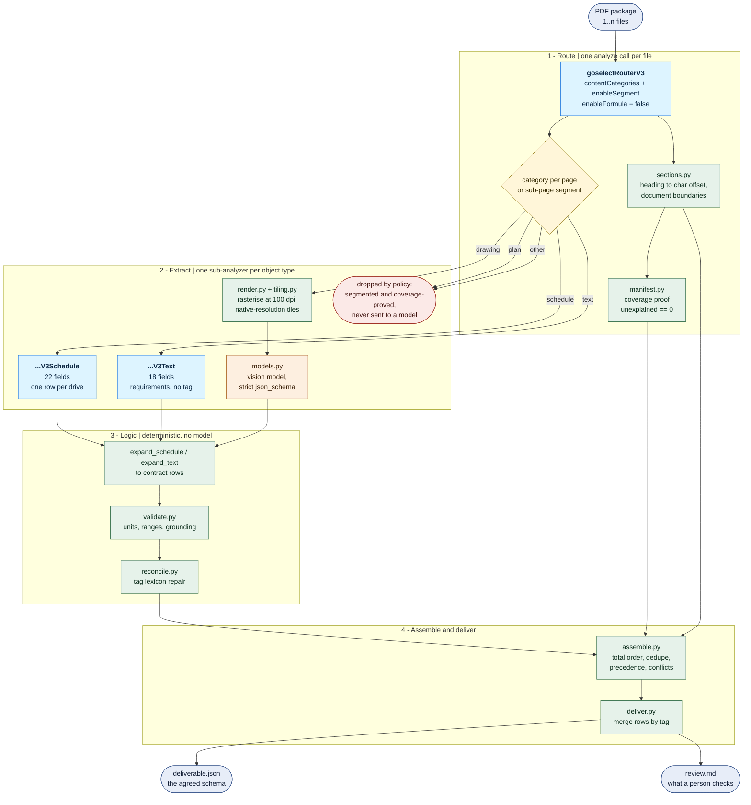
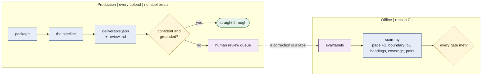

# Document processing for mixed engineering specification packages

Turns a heterogeneous specification package — prose, schedules, drawings, floor
plans, often scanned — into the customer's agreed extraction schema, with every
value traceable to a page, a bounding box and a section.

**The design in one line:** the pipeline's unit of work is the *content region*,
not the *file*. Everything else in the surrounding cloud architecture stays as
drawn.

```bash
pip install --user -e .[dev]
cp .env.example .env && az login       # then set CONTENTUNDERSTANDING_ENDPOINT

goselect-docproc setup-analyzer        # once: deploys the router + 2 sub-analyzers
goselect-docproc run sample_docs/98624_1_VFDSchedule.pdf --out out/run
```

Both commands default to the same analyzer id (`$CU_ANALYZER_ID`, else
`goselectRouterV3`). To use a different one, pass `--analyzer-id` to *both*.

That writes `out/run/deliverable.json` (the agreed schema, for the quotation
system) and `out/run/review.md` (the same values as a table a person can check).

---

## 1. The problem

A drives supplier receives specification packages from customers and channel
partners and must turn them into a bid. One opportunity arrives as several PDFs
mixing narrative specification, tabular schedules and engineering drawings.

Four defects were reported.

| # | Symptom | Actual cause |
|---|---|---|
| 1 | A mixed PDF is classified once and routed down one branch | The loop variable is the **file**. A file has one label; its pages do not |
| 2 | Section references are misattributed, worse on scans | Attribution fell back to *nearest text above in reading order*, wrong on two-column and landscape pages |
| 3 | Parallel per-type outputs are hard to recombine | No total order over the parts, and no proof nothing was dropped |
| 4 | Drawing tags come back corrupted: `VFD-401` → `$\sqrt{150-401}$` | `enableFormula` reads the box around a tag as a radical sign |

Plus one policy requirement: **floor plans must be excluded**. A scaled layout
shows where equipment physically sits; its dimension strings read as plausible
equipment tags, and it can never say which drive feeds which motor.

### The corpus

Real customer material, six PDFs.

- **`98624_1_VFDSchedule`** — one page, a 42-row VFD schedule under a three-level
  merged header. The extraction case.
- **`98850_1_CombinedElectrical`** — ten pages: prose, three schematic sheets,
  six floor plans. The classification and plan-drop case.
- **`98878_1` + `98878_2`** (Package A) — a nine-page scanned submittal plus a
  separate one-line diagram. Neither file alone can produce a quote: the
  specification names a manufacturer and no equipment; the one-line names four
  drives and no ratings; the ratings exist only as handwriting on the sheets. The
  specification says so itself — *"Refer to the single line diagrams on the
  electrical sheets for the minimum required VFD ampacity ratings."*
- **`98796_2`, `98813_2`** (Package B) — E-size drawing sets, no prose. The
  resolution case in §5.

---

## 2. What the pipeline does

Six stages, 4,125 lines across 19 modules.

| Stage | Input | Output | Module |
|---|---|---|---|
| **Ingest** | PDF bytes | `FileRef` with a frozen ordinal and a SHA-256 | `cli.py` |
| **Route** | PDF bytes | A category per page or sub-page segment, plus one immutable text string | `producers/content_understanding.py` |
| **Extract** | One segment | Fields, against the schema for *that* category | `extractors.py` |
| **Logic** | Raw fields | Units parsed, tags repaired, grounding enforced | `validate.py`, `reconcile.py` |
| **Assemble** | All segment results | One payload: ordered, deduped, conflicts surfaced | `assemble.py` |
| **Deliver** | The job result | The agreed schema + a human review sheet | `deliver.py` |

Coverage is proved alongside routing (`manifest.py`): every character is either
claimed by a segment or declared page furniture, and `unexplained == 0` is
asserted, not assumed.

**Split the index, not the bytes.** One analyze call per file produces one
immutable `content` string; every region is an `(offset, length)` range over it.
Regions are views, never copies, so reassembly is a sort.

### Execution order


```mermaid
flowchart TB
    classDef det fill:#e6f2ea,stroke:#2f6b46,color:#10301f,stroke-width:1px
    classDef svc fill:#ddf4ff,stroke:#0969da,color:#0a2540,stroke-width:1px
    classDef llm fill:#fdefe0,stroke:#a75c17,color:#3a2008,stroke-width:1px
    classDef gate fill:#fff6d9,stroke:#8a6d00,color:#332800,stroke-width:1px
    classDef io fill:#e7edf8,stroke:#33518a,color:#141f36,stroke-width:1px
    classDef drop fill:#fbe9e7,stroke:#a33227,color:#3d100b,stroke-width:1px

    IN(["PDF package<br/>1..n files"]):::io

    subgraph P1["1 - Route | one analyze call per file"]
        ROUTER["<b>goselectRouterV3</b><br/>contentCategories + enableSegment<br/>enableFormula = false"]:::svc
        CAT{"category per page<br/>or sub-page segment"}:::gate
        SEC["sections.py<br/>heading to char offset,<br/>document boundaries"]:::det
        COV["manifest.py<br/>coverage proof<br/>unexplained == 0"]:::det
    end

    subgraph P2["2 - Extract | one sub-analyzer per object type"]
        FSCH["<b>...V3Schedule</b><br/>22 fields<br/>one row per drive"]:::svc
        FTXT["<b>...V3Text</b><br/>18 fields<br/>requirements, no tag"]:::svc
        REND["render.py + tiling.py<br/>rasterise at 100 dpi,<br/>native-resolution tiles"]:::det
        VIS["models.py<br/>vision model,<br/>strict json_schema"]:::llm
        DROP(["dropped by policy:<br/>segmented and coverage-proved,<br/>never sent to a model"]):::drop
    end

    subgraph P3["3 - Logic | deterministic, no model"]
        EXP["expand_schedule / expand_text<br/>to contract rows"]:::det
        UNIT["validate.py<br/>units, ranges, grounding"]:::det
        LEX["reconcile.py<br/>tag lexicon repair"]:::det
    end

    subgraph P4["4 - Assemble and deliver"]
        MRG["assemble.py<br/>total order, dedupe,<br/>precedence, conflicts"]:::det
        DEL["deliver.py<br/>merge rows by tag"]:::det
    end

    OUT1(["deliverable.json<br/>the agreed schema"]):::io
    OUT2(["review.md<br/>what a person checks"]):::io

    IN --> ROUTER --> CAT
    CAT -->|schedule| FSCH
    CAT -->|text| FTXT
    CAT -->|drawing| REND --> VIS
    CAT -->|plan| DROP
    CAT -->|other| DROP

    ROUTER --> SEC --> COV
    FSCH --> EXP
    FTXT --> EXP
    VIS --> EXP
    EXP --> UNIT --> LEX --> MRG
    COV --> MRG
    SEC --> MRG
    MRG --> DEL --> OUT1
    DEL --> OUT2
```

Phase 1 is one service call per file. Phase 2 is the only place a model runs, and
for prose and schedules the service runs it inside the same call. Phases 3 and 4
are arithmetic.

---

## 3. Fix per problem

### Problem 1 — multi-type PDFs

`contentCategories` with `enableSegment`: five categories defined by description
alone, **no training data**. Live on the ten-page combined package:

```
f1-seg-001  p1-1   TEXT     conf=0.98  regions=['DRAWING','SCHEDULE','TEXT']
f1-seg-002  p2-2   DRAWING  conf=0.99  regions=['DRAWING','SCHEDULE','TEXT']
f1-seg-003  p3-3   DRAWING  conf=0.99  regions=['DRAWING','SCHEDULE','TEXT']
f1-seg-004  p4-4   DRAWING  conf=0.99  regions=['DRAWING','SCHEDULE','TEXT']
f1-seg-005  p5-10  PLAN     conf=0.99  regions=['DRAWING','TEXT']

coverage: accounted 100.00% (claimed 53843, furniture 1456, unexplained 0) [ok]
```

One file, five segments, six plan pages excluded — and the `regions` column shows
the intra-page split, so a schedule printed beside a drawing is separated from it.

**`drawing` vs `plan` is the load-bearing distinction.** Both are bordered sheets
with a title block, so it cannot be done geometrically:

- **drawing** — symbols joined by lines, shows connectivity, not to scale:
  one-line, single-line, network, control and ladder diagrams.
- **plan** — a scaled view of physical space with dimensions: site and building
  plans, layouts, routing, sections, elevations.

**PLAN is dropped at object granularity, never by page or file.** Implemented as
`DropExtractor`, which records *why* in the result. Dropping by simply omitting an
extractor was rejected: it leaves no trace and is indistinguishable from a routing
bug. Plan segments are still segmented and coverage-proved, so `unexplained` stays
0 and the completion count still balances.

`Pipeline._warn_on_collateral_drops` logs when a dropped segment also holds prose
or a grid — the whole-page case a page-level classifier forces.

### Problem 2 — traceability

**Grounding from the service.** `estimateFieldSourceAndConfidence` returns a page,
a bounding polygon and a 0–1 confidence per field. `parse_source()` turns
`D(page,x1,y1,…)` into page + polygon.

**Section breadcrumbs, which no service provides.** Grounding says *where on the
page*; a reviewer needs *which clause*. `sections.py` walks the service's own
`sections` tree by **span-ordered anchoring**: index every heading by its span
offset, then attribute any element to the last heading whose offset precedes it.
Binary search, exact, no model call.

The tree's root children are *separate documents stapled into one file*. On
Package A the specification occupies offsets 0–18,684 and the drawing sheets
18,708–21,911; attribution never crosses that line.

Two rules on top, because the tree is imperfect:

- **A sheet never inherits a prose clause.** `SELF_TITLING = {DRAWING, PLAN}` — a
  sheet carries its own title block and is not a clause of whatever precedes it.
- **No hierarchy means no headings.** A bare root emits nothing. Falling back to
  paragraph-role scanning produced **255 "headings"** on a one-line diagram — every
  equipment label on the schematic.

### Problem 3 — reconstructing parallel work

- **A total order:** `(file_ordinal, span_offset)`. The ordinal is frozen at job
  creation. Never sort by page — once a page holds several regions it is not a
  total order.
- **Idempotency:** the result id is `{jobId}:{fileId}:{segmentId}`, so
  at-least-once redelivery is an upsert.
- **Completion without polling:** count *distinct* terminal results and reconcile
  when `distinct(DONE) + distinct(FAILED) == expected_units`.
- **A coverage proof:** `claimed + furniture + unexplained == total`, and
  `unexplained == 0`.

**Merge precedence is customer policy, not engineering, and needs sign-off:**

| Value kind | Precedence | Reason |
|---|---|---|
| Numeric specifications | SCHEDULE > TEXT > DRAWING | The grid is authoritative |
| Pairing / topology | DRAWING > SCHEDULE > TEXT | The diagram shows the wiring |

Disagreement becomes a `Conflict` carried in the result, never silently resolved.
Segments marked `REVIEW` still contribute their payload — a reviewer needs
candidates to check, not a blank page.

### Problem 4 — corrupted tags

`enableFormula` is declared **false** on the router. The service default is true,
and on a drawing the box around a tag reads as a radical sign. This is the
`$\sqrt{150-401}$` defect, fixed by one flag.

---

## 4. One sub-analyzer per object type

This is the part that took two attempts, and the failure is instructive.

The customer's contract (`sample_docs/vfd_motor_schema_v1_0.json`) is **112 fields
across 6 levels**. `field_schema.py` converts it into a Content Understanding
`ContentFieldSchema`, and the service accepts it — status READY, zero warnings.

**It accepts the schema and then cannot fill it.** Asking for the whole contract
per row truncates the document:

| Schema | Rows returned | Contract populated |
|---|---|---|
| 112 fields, whole contract | **17 of 42** | 10%, `motor.*` and every `electrical.*` block empty |
| 22 fields, schedule-shaped | **42 of 42** | 31% |

We were asking for 112 × 42 = 4,704 values from a table with 18 columns. The model
fills the shallow fields of each row, then stops.

Three hypotheses were tested and eliminated before landing on size:

| Hypothesis | Test | Result |
|---|---|---|
| Descriptions too generic | Flat schema, contract's own wording | 42/42 — not the cause |
| Nesting too deep | Same value requested at depths 3, 4, 5, 6 at once | `45, 45, 45, 45` — not the cause |
| Category routing interfering | Full contract, routing bypassed | Still fails — not the cause |

So each category gets its own analyzer, sized to what that object can carry:

```
goselectRouterV3                    classify per page, drop PLAN
  ├─ schedule → …V3Schedule         22 fields, one row per drive
  ├─ text     → …V3Text             18 fields, requirements, no tag
  ├─ drawing  → local render + vision tiles
  └─ plan     → dropped
```

The 112-field contract is then assembled **in Python**, from a template derived
from the customer's own schema so the delivered shape cannot drift.

Measured on the 42-row schedule:

```
rows with tag           42/42        rows with voltage       42/42
rows with motor power   41/42        rows with enclosure     42/42
rows with power unit    41/42        rows with manufacturer  42/42
```

31% is the honest ceiling for *this* document: a VFD schedule has 18 columns and
the contract has 112 fields. It cannot state a motor's service factor because that
is not on the page. What matters is that everything the document does carry
arrives.

**Units come from the column header, not the cell.** The cell holds `45`; `HP`
lives in the merged header. A power value without a unit is a quoting hazard, so
the schedule schema asks for the unit separately.

**Prose rows are deliberately tagless.** A specification states what any drive
must satisfy and names no equipment, so `expand_text` can never emit a `Pair`.
Assembly merges the requirement row into the tagged rows a schedule supplies.

### Why Content Understanding, and what it does not do

The Document Intelligence path was deleted after a bench-off. The decisive fact
was a capability gap, not a quality gap: a heuristic classifier **cannot emit
`PLAN`**, because a scaled layout and a one-line are both sparse bordered sheets.
It could never implement the plan-drop policy. Removing it took out 1,289 lines.

**But the service cannot read engineering drawings.** `enableFigureAnalysis`
supports `Bar`, `Line`, `Pie`, `Radar`, `Scatter`, `Bubble`, `Quadrant`, `Mixed`,
`Flow chart`, `Sequence` and `Gantt` — all business charts. A one-line diagram is
none of them, and the service returns figure *descriptions* with **no image bytes
and no retrieval endpoint**. So `render.py`, `tiling.py` and `models.py` stay:
the drawing image is produced locally and read at native resolution.

| Gap no vendor fills | Why |
|---|---|
| Section breadcrumbs | Grounding answers *where on the page*, not *which clause* |
| Native-resolution CAD reading | Every vision path downscales to a token budget |
| Cross-region precedence | "A schedule outranks a drawing for a kW rating" is customer policy |

---

## 5. Drawings: the bottleneck is pixels, not the model

On Package B the service returned `VD-401` paired with `RWP-A01`. The truth is
`VFD-401` feeding `RWP-401` — a dropped glyph and a `4→A` substitution, both
signatures of text below legibility.

Walking the resolution ladder on sheet 1, with the package-wide tag lexicon:

```
source                        tiles  vis-tokens   VFD-401 / RWP-401
service figure crop 1477x934    —        —        VD-401 / RWP-A01   WRONG
rendered  100 dpi 3600x2400    24      ~18k       VFD-401 / RWP-401  correct
rendered  150 dpi 5400x3600    48      ~37k       VFD-401 / RWP-401  correct
```

**100 dpi is the default**: same tags as 150, half the tokens, and it fits under
the 40-tile cost guard where 150 does not.

Model choice differs by branch, and the evidence points opposite ways:

```
TEXT (Package A specification, against a hand-typed key)
  gpt-5.4-mini    9/10 values,  9/10 clauses,  3.3s    <- good enough
  gpt-5.6-sol    10/10 values, 10/10 clauses,  7.0s

DRAWING (Package B sheet 1)
  gpt-5.4-mini    whole image   8 tags   0/4 drives    <- all fabricated
  gpt-5.6-sol     tiled        10 tags   4/4 drives
```

The mini invented a plausible tag scheme that appears nowhere on the drawing.

### Service limits that shape the design

- **Images per request: 50.** A four-sheet segment at 100 dpi produces 51 tiles
  and fails with `HTTP 400`. Tiles are batched and merged.
- **Tile cap raises, never truncates.** Exceeding `max_tiles` throws, so a cost
  overrun is visible rather than becoming quiet content loss.
- **Vision downscaling.** `detail="high"` fits into 2048×2048, then scales again
  so the *shortest* side is 768 px. On an E-size sheet 10 pt glyphs arrive ~3 px
  tall.
- **Async limits:** 200 MB / 300 pages; results auto-deleted after 24 h.
- **No result caching.** Document Intelligence cached by SHA-256; Content
  Understanding does not, so every run bills again.

---

## 6. What is proven, and what is not

**Proven on real customer data:** per-page classification at 0.98–0.99 confidence
including plan/drawing separation, 100% coverage on every document, plan drop at
object granularity, section breadcrumbs on a scanned document, intra-page
separation, drive-schedule extraction at 42/42 rows, and tag-level accuracy on an
E-size drawing package once rendered at 100 dpi.

**Not proven:**

1. **Pair precision.** Both engines emitted soft-starter tags as though they were
   drives. Quoting six drives instead of four is exactly the commercial error this
   exists to prevent.
2. **Schedule pairs are one-sided.** The contract keys a pair on a single `tag`
   and gives the motor no identifier, so `pair_f1` cannot be scored. See §7.
3. **Classifier determinism.** Category assignment was stable across runs, but the
   *grouping* of consecutive same-category pages was not, and one document
   returned 16 rows on one run and 42 on the next. Harmless while plans are
   dropped either way; not harmless for a category that gets extracted.
4. **Confidence is inverted.** On the schedule, fields **with** a value scored
   0.219–0.864; fields **with no** value scored 0.920–0.972. The service is most
   confident when it concludes a field is absent. Any review threshold must be
   calibrated on populated fields only — `PipelineConfig.field_review_threshold`
   is a placeholder, not a validated number.
5. **The eval labels are stale.** `eval/labels/*.json` predate the five-category
   taxonomy, contain only `TEXT` and `DRAWING`, and cover 2 of 6 documents. They
   cannot score plan suppression or schedule routing.

**Every number here comes from six documents.**

### The evidence loop

`eval/score.py` asserts gates and exits non-zero, so it belongs in CI. **It never
runs in production** — labels are exam papers, not pipeline inputs.


```mermaid
flowchart LR
    classDef off fill:#e7edf8,stroke:#33518a,color:#141f36,stroke-width:1px
    classDef human fill:#f3e9f7,stroke:#6b3b86,color:#2b1636,stroke-width:1px
    classDef gate fill:#fff6d9,stroke:#8a6d00,color:#332800,stroke-width:1px
    classDef good fill:#e6f2ea,stroke:#2f6b46,color:#10301f,stroke-width:1px

    subgraph PROD["Production | every upload | no label exists"]
        NEW["package"]:::off --> PIPE["the pipeline"]:::off
        PIPE --> DELIV["deliverable.json<br/>+ review.md"]:::off
        DELIV --> CONF{"confident and<br/>grounded?"}:::gate
        CONF -->|yes| THRU(["straight through"]):::good
        CONF -->|no| REVQ["human review queue"]:::human
    end

    subgraph OFF["Offline | runs in CI"]
        LABELS["eval/labels"]:::human --> SCORE["score.py<br/>page F1, boundary IoU,<br/>headings, coverage, pairs"]:::off
        SCORE --> VERD{"every gate met?"}:::gate
    end

    REVQ -.->|a correction is a label| LABELS
```

**The review queue produces labels for free.** When a reviewer corrects an
extraction, that correction is a label. The orchestration design already stores
user corrections in the job record — that field *is* the label pipeline.

---

## 7. Decisions the customer must make

1. **A motor tag in the contract.** Ground truth pairs a drive with a motor
   (`VFD-H1` ↔ `HIGH SERVICE PUMP 1`), but the schema has one `tag` per pair and
   no motor identifier. Pairs are therefore one-sided and pair accuracy cannot be
   scored. Add `motor_tag`, or rename `tag` → `vfd_tag` and add one.
2. **Merge precedence** — does a schedule or a drawing win a disagreement about a
   motor rating?
3. **Review threshold** — what does a wrong rating cost in a quote, versus a
   person's time to check it? See the inverted-confidence finding above.
4. **Failure posture** — fail closed, return partial data flagged, or hold for
   review? The default here is *partial, flagged, held*.
5. **Residency and language scope.**
6. **Corpus access** — 15–20 real packages, labelled with the five-category
   taxonomy. The critical-path dependency; no code substitutes for it.

---

## 8. Running it

The devcontainer resolves packages through the Microsoft CFS proxy
(`packagefeedproxy.microsoft.io`); the public PyPI wheel CDN is not routable.
`PIP_INDEX_URL` is set in `.devcontainer/devcontainer.json`, so pip needs no flags.

```bash
# The devcontainer does this on create; this is the manual equivalent.
# No venv: the workspace is a bind mount, and --user installs to the
# container's own filesystem instead of across it.
pip install --user -e .[dev]

cp .env.example .env      # fill in CONTENTUNDERSTANDING_ENDPOINT
az login                  # DefaultAzureCredential

pytest -q                 # 142 tests, no cloud calls, no spend
```

| Command | Cost | Purpose |
|---|---|---|
| `setup-analyzer` | none | Deploy the two field analyzers, then the router. Run once per schema change |
| `segment <pdf>...` | one analyze call per file | Categories, regions and the coverage proof |
| `plan <pdf>...` | one analyze call per file | The exact queue messages that would be sent |
| `run <pdf>... [--model <deployment>]` | analyze + model | Full pipeline → `deliverable.json`, `review.md` |
| `tiles <width> <height>` | none | Vision budget before spending a token |
| `python eval/report.py <pdf>...` | analyze + model | Self-contained HTML report |
| `python eval/score.py` | none | The scorecard, exits non-zero on a failed gate |
| `python eval/inpage_bench.py` | analyze calls | Page-level vs in-page segmentation |

Every command that reaches the service takes `--analyzer-id`, defaulting to
`$CU_ANALYZER_ID` and then to `goselectRouterV3`. The two field analyzers are
derived from it (`<id>Schedule`, `<id>Text`), so `setup-analyzer` and `run` stay
in step as long as both see the same id. If the analyzer does not exist the CLI
says so and names the setup command, rather than raising `ModelNotFound`.

Everything under `out/` is regenerable.

---

## 9. Integration

**One new state, one changed loop variable, one new state at the tail.** Object
storage, the message bus, container jobs, the document store, the model gateway,
API management, identity, secrets, correlation ids and CI/CD all stay as drawn.

```
Initialise
  └─ Segmentation                          <-- NEW
       └─ Extraction_Orchestration
            ├─ for each TEXT segment      -> routed sub-analyzer
            ├─ for each SCHEDULE segment  -> routed sub-analyzer
            ├─ for each DRAWING segment   -> vision, native-res tiles
            └─ for each PLAN segment      -> dropped, with a reason
       └─ JSON_Validation
       └─ CrossSegment_Reconciliation      <-- NEW
       └─ Save_Results
```

`pipeline.py` maps 1:1 onto those states, so the logic can be adopted without
adopting the runtime. Concurrency here is a thread pool; in production it is queue
depth, and nothing in the logic depends on which.

**Storage — write once, never mutate.** The document store holds job state and one
document per segment result, partitioned on `/job_id`. Nothing large goes in the
document store; nothing mutable goes in object storage.

**The queue message is a pointer, never a payload** — job and correlation ids, file
and segment ids, page range, spans, section root, analysis URI, figure ids and the
per-segment feature flags. The worker fetches the slice it needs.

**Per-segment feature flags.** High-resolution OCR on prose pages is money burned:

| Segment | `highResolution` | `formula` |
|---|---|---|
| TEXT | off | off |
| SCHEDULE | off | off |
| DRAWING | **on** | **off** |

**Alert on three things**, all silent failures otherwise: `unexplained_chars > 0`,
the share of segments routed to review, and tiles per drawing above the guard.

**Durable restart.** `poller.continuation_token()` plus
`begin_analyze(continuation_token=…)` resumes an analyze call across a container
restart, which is what makes this safe in a job runtime.

---

## 10. Phasing

| Phase | Content | Exit criterion |
|---|---|---|
| 0 — Free fixes | `enableFormula` off for drawings; read the coverage report | Coverage 100%, tag corruption gone |
| 1 — Contract | Add a motor tag; agree merge precedence | Customer signs both |
| 2 — Evidence | Label 15–20 real packages with the five categories | **Go / no-go gate** |
| 3 — Shadow | Run alongside the current pipeline, writing deliverables but not consuming them | Output compared on the same documents |
| 4 — Cut over | Change the loop variable one content type at a time | Correction rate at or below baseline |
| 5 — Scale | Widen the corpus and the document types | One code path |

Phases 0 and 1 have no dependency on Phase 2 and should start immediately.
