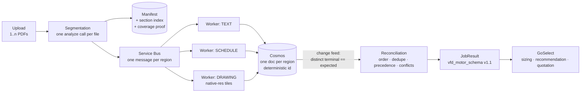

# GoSelect Copilot — solution proposal for ABB

**Purpose.** Turn a heterogeneous customer specification package into validated,
traceable, quotation-ready structured data that GoSelect can consume.

**Scope of this document.** The three defects ABB reported, the recommended fix
for each, the evidence that decides how much machinery is justified, and the
integration path into the Container Apps / Service Bus / Cosmos architecture
already agreed in *GoSelect Copilot Production Architecture*.

This document does **not** re-propose the production platform. Blob, Service Bus,
Container Apps Jobs, Cosmos, Foundry, APIM, Entra, Key Vault, correlation IDs and
CI/CD stay exactly as drawn. What changes is the **unit of work** and the
**contract that unit produces**.

---

## 1. The three defects, restated precisely

| # | ABB's symptom | Actual cause | Class of fix |
|---|---|---|---|
| 1 | A package containing prose, schedules and drawings is classified once and routed down one branch | The loop variable is the **file**. A file has one label; its pages do not | Change the loop variable |
| 2 | Section references are misattributed, worse on scans | Attribution falls back to *nearest text above in reading order*, which is wrong on two-column and landscape pages. Scans lose paragraph `role` entirely | Anchor by span offset, not proximity; report scanned accuracy separately |
| 3 | Parallel per-type outputs are hard to recombine into something a human can read | There is no total order over the parts, and no proof that nothing was dropped | A deterministic ordering key plus a coverage assertion |

A fourth defect was reported inside #1 and is worth separating because it is
cheap to fix: drawing tags come back corrupted (`VFD-401` → `$\sqrt{150-401}$`).
That is two stacked causes — `ocr.formula` detecting the box around a tag as a
radical, and the sheet being downscaled below glyph legibility before the vision
model sees it. Neither is an OCR-quality problem and neither is fixed by raising
OCR resolution, which is exactly what ABB observed.

---

## 2. The one design decision

> **Route by content region, not by file.**

Everything else follows. A page holding a motor schedule *and* an inset
single-line diagram yields two work items with two different prompts and two
different Document Intelligence feature flags. A 40-page package yields as many
work items as it has coherent regions, not one.

The corollary that makes it safe: **split the index, not the bytes**. One layout
call per file produces one immutable `content` string; every region is a
`(offset, length)` span range over it. Regions are therefore views, never copies,
and reassembly is a sort rather than a merge.

---

## 3. Recommended architecture



**One new state** (`Segmentation`), **one changed loop variable**
(`for each file` → `for each region`), and **one new state** at the tail
(`CrossSegment_Reconciliation`). Nothing else in the agreed architecture moves.

### 3.1 Engine choice — and why it is a measurement, not an argument

The segmentation/extraction engine sits behind a single interface. Two candidates
are viable on Azure today:

| Engine | Gives you | Does not give you |
|---|---|---|
| **Content Understanding** (GA, `2025-11-01`) | Classify + split a package by category description, route each category to its own analyzer, extract to a nested field schema, **per-field page + bounding box grounding and confidence** (`estimateFieldSourceAndConfidence`), bring-your-own Foundry model deployment, 300 pages / 200 MB per async call | Intra-page classification — *"The minimum unit for classification of documents is a single page"* |
| **Document Intelligence Layout** (GA) | Paragraph roles, tables with cell geometry, figure regions, server-side figure crops, spans over one canonical content string — i.e. everything needed to split **inside** a page | Field extraction, confidence, grounding. Those you build |

The recommendation is **Content Understanding as the engine, with a thin
deterministic layer for the four things it provably cannot do**:

1. intra-page region separation,
2. section breadcrumbs (grounding gives page + box, not "§3.2 Motors"),
3. native-resolution reading of E-size drawing sheets,
4. cross-region precedence and conflict surfacing.

See [ALTERNATIVES.md](ALTERNATIVES.md) for the full build-vs-buy comparison,
including Mistral OCR 4, Docling, LlamaParse, Reducto and LandingAI ADE.

---

## 4. Problem 1 — multi-type PDFs

### 4.1 The fix

Two levels, applied in order:

**Level A — page-level split.** Content Understanding `contentCategories` with
`enableSegment` classifies and splits the package in one call, categories defined
by description rather than by training data, each category routed to its own
analyzer. This replaces ABB's current per-file classifier outright and requires
no labelled corpus.

**Level B — intra-page split.** For pages carrying more than one content kind,
regions are separated deterministically by span subtraction over the Layout
result, with two rules that make it exact rather than a proximity guess:

- **Claim order depends on content type.** On a drawing sheet the title block,
  revision table and BOM are *tables* that belong to the drawing, so figures
  claim first. On a schedule page, tables claim first.
- **Containment.** A figure absorbs any table whose bounding box sits inside it.

On the ABB sample catalogue, **15 of 20 pages carry more than one content kind
and 4 carry all three**. Under the current file-level design every one of those
pages is partially mis-routed.

### 4.2 The A/B that decides how much of this to ship

Level B is real complexity. It should be earned, not assumed. There is a genuine
possibility that it is solving a 2024 problem: current multimodal models handle a
page containing prose, a grid and an inset diagram in a single pass, which is not
true of the models the three-flow design was built around.

So the pilot runs **two arms over the same corpus and the same schema**:

| Arm | Description | Cost |
|---|---|---|
| **A — page route** | Content Understanding classifies and splits by page, routes each page to a per-category analyzer. No intra-page code | Low |
| **B — region route** | Arm A plus intra-page span subtraction and per-region prompts | Higher |

**Ship Arm A unless Arm B improves VFD–motor pair F1 by a material margin on
ABB's real packages.** Deciding this with a number rather than a design argument
is the single highest-value thing the pilot does, because it determines whether
ABB maintains one code path or three.

### 4.3 Same-day fixes, independent of the above

| Fix | Effect | Risk |
|---|---|---|
| Set `ocr.formula = off` on drawing content | Stops tag boxes being read as radicals | None. It is currently on globally and helps nothing |
| Set `splitMode = auto` if a DI custom classifier is in use | v4.0 GA defaults to `none`, returning **one class for a multi-document PDF** — precisely the reported symptom | None. One parameter |
| Tile drawing sheets at native resolution | An E-size sheet at 300 DPI downscales 10 pt tag text to ~4 px at standard vision tier. At 4 px, `V→1, F→5, D→0` is the expected outcome | Cost. Bound it — see §7 |

---

## 5. Problem 2 — context and reference traceability

Three layers, cheapest first. **Layer 1 is a prerequisite for the other two and
is not currently satisfied.**

### Layer 1 — the output schema has nowhere to put evidence

`vfd_motor_schema_v1_0.json` defines 107 fields across 4 levels and contains **no
provenance field of any kind**. Traceability cannot survive a contract that has
no slot for it. Proposed `v1.1` adds one block per pair and one per contested
value:

```jsonc
"source": {
  "file_id":      "f1",
  "page":         14,
  "section_path": "3. Scope of Supply > 3.2 Motors",
  "spans":        [{ "offset": 48210, "length": 122 }],
  "polygon":      [/* 8 floats, page coordinates */],
  "origin":       "SCHEDULE",          // which content kind asserted this
  "verbatim":     "M-401  75 HP  460V",
  "confidence":   0.94
}
```

This is additive and backward-compatible. Everything downstream of it — review
UI highlighting, audit, dispute resolution against the customer's own document —
depends on it existing.

### Layer 2 — grounding from the service, free

Content Understanding returns **page number and bounding box per extracted
field** when `estimateFieldSourceAndConfidence` is set on the analyzer (or
`estimateSourceAndConfidence` per field). As of the July 2026 release this covers
`extract`, `classify` **and** `generate` fields. That populates `page`,
`polygon`, `confidence` and `verbatim` with no custom code, and gives a
per-field confidence that drives review routing directly.

### Layer 3 — section breadcrumbs, which no service provides

Grounding tells you *where on the page*. ABB needs *which clause*. The fix is
**span-ordered anchoring**: index every heading by its character offset, then
attribute any element to the last heading whose offset precedes it — binary
search, exact, no model call. Nearest-text-above is abandoned entirely.

**Scanned documents are the hard case and must be reported separately.** Scans
lose paragraph `role`, so heading detection falls back to geometry (glyph height
versus body median, bold spans, numbered-heading pattern). That fallback declares
itself unreliable so the caller can route to review. A blended digital+scanned
accuracy number hides exactly the failure ABB reported, so the scorecard carries
two gates:

| Metric | Gate |
|---|---|
| Section attribution — digital | ≥ 0.95 |
| Section attribution — **scanned** | ≥ 0.80 |

### Layer 4 — the rule that makes it stick

> **Every value carries page, span and section evidence, or it is rejected.**

Not "logged with a warning". Rejected, and the region routed to review. This is
what converts traceability from a feature into an invariant.

---

## 6. Problem 3 — reconstructing parallel work

Four mechanisms, all deterministic, all unit-testable without Azure.

**1. A total order.** The global sort key is `(file_ordinal, span_offset)`.

- `file_ordinal` is **frozen at job creation**. Upload order is the contract and
  is never re-derived.
- **Never sort by page number.** Once a page holds several regions, page number
  is not a total order.

Workers may finish in any order, across any number of queues, on any number of
replicas. Reassembly is a sort.

**2. Idempotency.** Service Bus is at-least-once; the same region *will* be
processed twice under lock expiry. The Cosmos document id is deterministic —
`{jobId}:{fileId}:{segmentId}` — so redelivery is an upsert, not a duplicate.

**3. Completion without polling.** Never increment a counter for progress. Count
**distinct** terminal region documents and trigger reconciliation from the Cosmos
change feed when `distinct(DONE) + distinct(FAILED) == manifest.expected_units`.
This survives worker restarts and duplicate delivery, and needs no timer.

**4. A coverage proof.** Segmentation asserts that
`claimed + furniture + unexplained == total characters`, and that
`unexplained == 0`. On the ABB switchboard package: *100.00% accounted, 0
unexplained characters*. Alert on `unexplained_chars > 0` — that is segmentation
silently dropping content, and it is the failure mode nobody notices.

### 6.1 Merge precedence — state it, do not imply it

When two regions disagree, the winner must be a documented rule, not an accident
of iteration order. **This table needs ABB's sign-off; it is a domain judgement,
not an engineering one.**

| Kind of value | Precedence | Reason |
|---|---|---|
| Numeric specifications (kW, V, A, FLA) | SCHEDULE > TEXT > DRAWING | The grid is authoritative |
| Pairing / topology (which VFD feeds which motor) | DRAWING > SCHEDULE > TEXT | The diagram shows the wiring |

Disagreement that survives precedence becomes a `Conflict` object carried in the
result and routed to review. It is never silently resolved. Corroboration across
region types raises pair confidence; it never invents a pair.

Partial failure yields `REVIEW` with a stated count of missing regions — never a
quietly shortened result that looks complete.

---

## 7. Cost control on drawings

Native-resolution tiling is the fix for corrupted tags, and it is the one part of
this design that can spend real money. A fully tiled E-size sheet is roughly
235,000 visual tokens.

Three bounds, all mandatory:

1. **Tile around detected content**, not the whole sheet. Use the engine's
   figure regions to bound the area.
2. **Hard `max_tiles` guard per sheet**, defaulting low, so a runaway sheet
   cannot silently cost more than the quotation is worth.
3. **Alert on tiles-per-drawing above the guard** — it is the leading indicator
   of classifier drift onto the drawing path.

Per-segment feature flags matter here too. Applying `ocr.highResolution` to a
whole package is money spent on prose pages:

| Region kind | `ocr.highResolution` | `ocr.formula` |
|---|---|---|
| TEXT | off | off |
| SCHEDULE | off | off |
| DRAWING | **on** | **off** |

---

## 8. What is deliberately not built

Stating this matters as much as stating what is built.

- **No new runtime.** No Durable Functions migration, no orchestration rewrite.
  The recommendation is to keep the Python state machine in Container Apps Jobs.
- **No markdown re-assembler as a deliverable.** The artefact GoSelect consumes
  is JSON. A markdown reassembly exists for audit and chat context only; do not
  build a consumer that does not exist.
- **No custom classifier training** in the first phase. Category descriptions
  replace labelled data. Revisit only if measured accuracy demands it.
- **No fine-tuning.** Nothing in the reported defects is a model-capability
  problem.
- **No model in the deterministic path.** Unit parsing, arithmetic,
  deduplication, ordering and homoglyph repair are code. A model that is asked to
  do arithmetic will eventually do it wrong, silently, and without evidence.

---

## 9. Proof of value — the test plan

This is the part ABB asked for and the part that must come before integration.

### 9.1 Corpus

**15–20 real customer specification packages**, not catalogues. Product
catalogues have consistent templated layout; customer packages do not. The
sample set must include:

- at least 3 **scanned** packages (the reported failure mode),
- at least 3 packages containing **E-size single-line diagrams or P&IDs**,
- at least 2 packages mixing all three content kinds on the same page,
- the range of page counts ABB actually sees (the stated range for text specs is
  1–40 pp).

Each is hand-labelled once: page content kinds, region boundaries, section
attribution for a sample of values, and the ground-truth VFD–motor pairs.

### 9.2 Gates

The scorecard is executable and exits non-zero on failure, so it belongs in CI
rather than in a slide.

| Metric | Gate | What it protects |
|---|---|---|
| Page classification macro-F1 | ≥ 0.85 | Routing correctness |
| Region boundary IoU | ≥ 0.90 | Problem 1 |
| Section attribution — digital | ≥ 0.95 | Problem 2 |
| Section attribution — scanned | ≥ 0.80 | Problem 2, honestly |
| Coverage pass rate | = 1.00 | Problem 3 |
| **VFD–motor pair F1** | ≥ 0.90 | The business outcome |
| Grounded-value rate | ≥ 0.98 | Traceability as an invariant |
| Cost per package (USD) | reported | Commercial viability |
| Manual correction rate | reported | The number that justifies the project |

### 9.3 Arms

Run the same corpus through both arms of §4.2 and, if residency permits, a third
non-Azure arm as a control. Publish one table. Delete the losing code paths
before integration — shipping optionality is shipping maintenance.

### 9.4 Deliverable shape

Not a notebook. A notebook proves a demo; it does not prove a pipeline.

| Artefact | Purpose |
|---|---|
| **CLI** — `segment`, `plan`, `run`, `bench`, `score` | ABB runs it themselves against their own documents, offline, with no spend on `segment` beyond one analyze call per file |
| **Container image** | The same code the workers will run |
| **Reference API** — `POST /jobs`, `GET /jobs/{id}` | The integration seam, so GoSelect can be wired before the pipeline is final |
| **Contracts package** — manifest, queue message, region result, `JobResult` | The only thing crossing a process boundary. Versioned |
| **Scorecard** — `eval/score.py` against labelled corpus | The go/no-go evidence |
| **Unit suite** — no Azure dependency, no spend | Runs in ABB's CI on day one |

Everything deterministic is testable without a key. That is what makes the
pipeline reviewable by ABB's own engineers rather than taken on trust.

---

## 10. Integration into the agreed architecture

### 10.1 State machine delta

```
Initialise
  └─ Segmentation                          <-- NEW
       └─ Extraction_Orchestration
            ├─ for each TEXT region      -> LLM (APP / VFD / MOTOR)
            ├─ for each SCHEDULE region  -> LLM (PAIR, from table JSON)
            └─ for each DRAWING region   -> LLM (PAIR, vision, native-res tiles)
       └─ JSON_Validation
       └─ CrossSegment_Reconciliation      <-- NEW
       └─ Save_Results
```

### 10.2 Storage layout — write once, never mutate

```
jobs/{jobId}/manifest.json
jobs/{jobId}/files/{fileId}/source.pdf
jobs/{jobId}/files/{fileId}/analysis.json     <- full engine result
jobs/{jobId}/files/{fileId}/content.md        <- canonical content string
jobs/{jobId}/files/{fileId}/figures/{id}.png
```

Cosmos holds job state and one document per region result. Nothing large goes in
Cosmos; nothing mutable goes in Blob. Partition key `/job_id` — all
reconciliation reads are job-scoped, so merge stays single-partition.

### 10.3 Queue message — a pointer, never a payload

```json
{
  "schema_version": "1.0.0",
  "job_id": "…", "correlation_id": "…",
  "file_id": "f1", "file_ordinal": 0,
  "segment_id": "f1-seg-003",
  "content_type": "DRAWING",
  "first_page": 8, "last_page": 9,
  "spans": [{ "offset": 48210, "length": 3122 }],
  "section_root": "3. Scope of Supply > 3.2 Motors",
  "analysis_uri": "jobs/…/files/f1/analysis.json",
  "figures": ["8.1", "9.1"],
  "high_resolution": true,
  "formulas": false
}
```

The worker fetches the slice it needs. Messages stay far below Service Bus size
limits regardless of document size, and the queue never carries content.

### 10.4 Observability

Propagate `correlation_id` from upload → queue → worker → engine call → model
call → validation → GoSelect callback. Emit `model`, `latency_ms`,
`input_tokens`, `output_tokens`, `attempts` as custom dimensions keyed by
`job_id` and `segment_id`.

Alert on three things, all of which are silent failures otherwise:

- `coverage.unexplained_chars > 0` — segmentation dropping content;
- regions routed `REVIEW` as a share of total — classifier drift;
- tiles per drawing above the guard — runaway vision cost.

### 10.5 Model layer

One interface, one implementation per Foundry deployment:

```python
class ModelClient(Protocol):
    name: str
    def complete_json(self, *, prompt, schema, images=None) -> dict: ...
```

Schema rules that apply to every provider, because they remove a whole class of
bug rather than working around it:

- every property `required`; absence expressed as explicit `null`;
- `additionalProperties: false`;
- **flat and shallow** for the model, expanded to ABB's nested `v1.1` shape in
  Python.

ABB's schema is 4 levels deep with 107 fields. Asking a model to emit that
directly is the likely cause of the omitted-nested-field failures already seen.
Ask for flat, expand in code — the expansion is deterministic and testable.

A null-model implementation runs the entire pipeline end to end with zero spend,
which is what makes the unit suite and CI possible.

---

## 11. Phasing

| Phase | Content | Exit criterion |
|---|---|---|
| **0 — Free fixes** | `ocr.formula` off for drawings; `splitMode=auto`; run `segment --strict` over the existing corpus and read the coverage report | Coverage 100%, tag corruption reduced, no code deployed |
| **1 — Contract** | Agree `vfd_motor_schema v1.1` with the `source` block; agree the merge precedence table | ABB signs both |
| **2 — Evidence** | Hand-label 15–20 real packages including scans and E-size drawings; run both arms; publish the scorecard | **Go / no-go gate.** Gates in §9.2 met |
| **3 — Shadow** | Run the winning arm alongside the current pipeline, writing manifests but not consuming them | Output compared against today's on the same documents |
| **4 — Cut over** | Change the loop variable one content type at a time, review threshold high and falling as evidence accumulates | Manual correction rate at or below baseline |
| **5 — Consolidate** | Delete the losing arm and any unused engine adapter | One code path |

Phase 0 and Phase 1 have no dependency on Phase 2 and should start immediately.

---

## 12. Decisions ABB must make

These are not engineering choices and should not be made by the delivery team.

1. **Merge precedence** (§6.1) — does a schedule or a drawing win a disagreement
   about a motor rating?
2. **Failure posture** — on partial extraction, does the job fail closed, return
   partial data flagged, or hold for review? The design supports all three; the
   default here is *partial, flagged, held*.
3. **Residency** — Content Understanding and Document Intelligence are
   Azure-native. Some higher-scoring alternatives are not, and one Azure-hosted
   model deployment option would move inference outside Azure. See
   [ALTERNATIVES.md](ALTERNATIVES.md) §5.
4. **Language scope** — Azure-hosted Mistral OCR is documented as English-only.
   If customer packages arrive in other languages, that option is excluded before
   any accuracy discussion.
5. **Review capacity** — the review queue is where trust is built. Who staffs it,
   and what correction rate is acceptable at go-live?
6. **Corpus access** — nothing in §9 can start without 15–20 real customer
   packages including scans. This is the critical-path dependency.

---

## 13. Risks

| Risk | Likelihood | Mitigation |
|---|---|---|
| Real customer packages score far below the catalogue sample | High | This is why Phase 2 is a gate, not a milestone. Every number produced before it is illustrative |
| Intra-page routing turns out not to move pair F1 | Medium | Good news, not bad. Arm A ships and a large amount of code is never written |
| Drawing tiling cost exceeds the value of automation on drawing-heavy packages | Medium | Cost per package is a reported metric in §9.2. Cap tiles; consider routing drawing-heavy packages to review by default until measured |
| Section accuracy on scans stays below gate | Medium | Report separately, route below-threshold regions to review, and treat scanned packages as a distinct rollout wave |
| Engine capability changes under the pipeline | High — this space moves fast | The engine sits behind one interface and is chosen by scorecard. Re-run the bench when a candidate ships, do not re-architect |

---

## 14. Summary

- **One design change**: route by content region, not by file.
- **One managed engine** doing classification, splitting, field extraction,
  grounding and confidence — Content Understanding, chosen by measurement.
- **A thin deterministic layer** for the four things no service does: intra-page
  separation, section breadcrumbs, native-resolution drawing reading, and
  cross-region precedence with conflict surfacing.
- **One invariant**: no value without evidence.
- **One gate**: 15–20 real packages, published scorecard, go/no-go.
- **Zero change** to the agreed production architecture.
